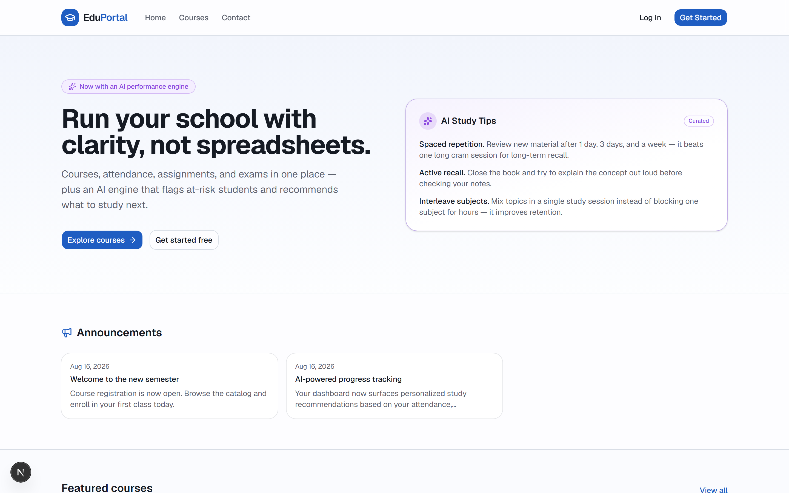
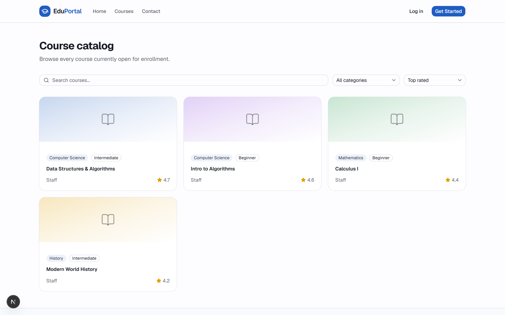
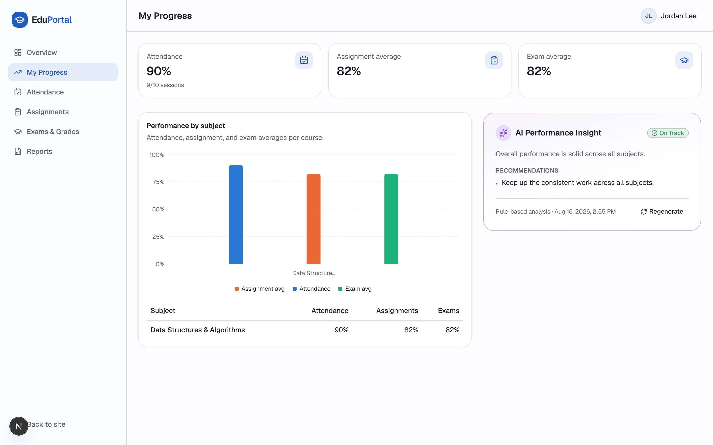
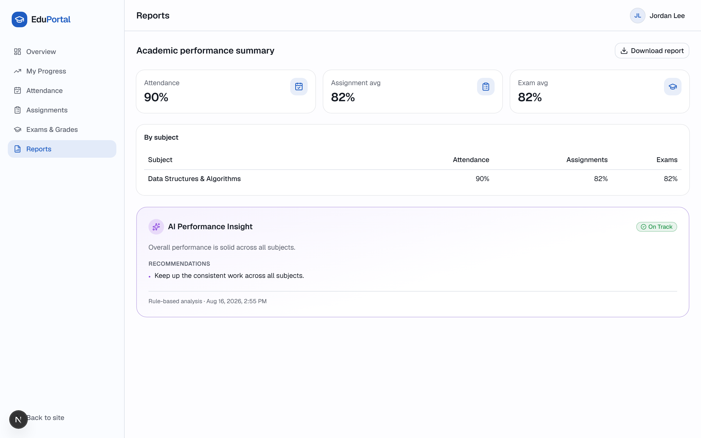
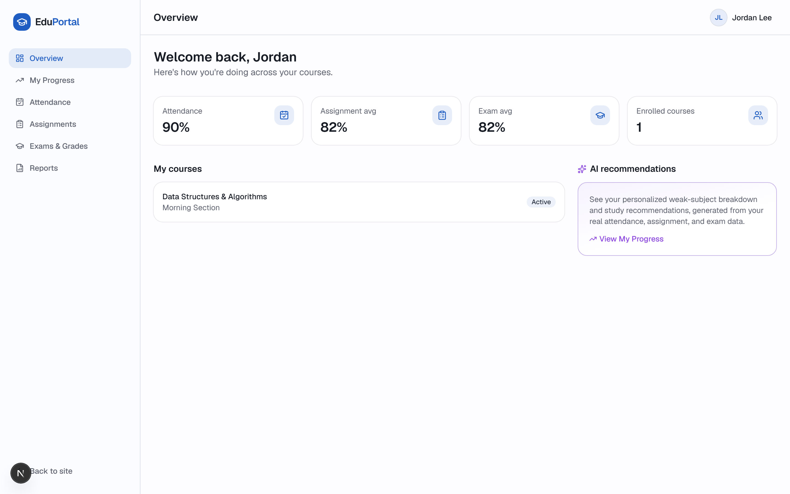

# EduPortal

**An AI early-warning system for schools: it doesn't just manage courses and grades — it detects which students are falling behind, explains the evidence, generates a personalized intervention plan, and lets teachers track it to completion.**

## The problem

Schools track attendance in one tool, grades in a spreadsheet, and assignments somewhere else — so nobody notices a struggling student until report cards go out. Teachers and admins are left manually cross-referencing numbers to spot who needs help, and even when they do, "this student is struggling" isn't the same as knowing what to actually do about it.

## The solution

EduPortal runs one continuous loop for every student: **Risk → Explain → Intervene → Track.**

1. **Risk** — attendance, assignment, and exam data is aggregated and scored: low / medium / high risk, with a confidence level based on how much data actually exists.
2. **Explain** — an evidence table (real computed numbers, not AI-invented ones) and a plain-language cause-and-effect explanation: *"Ethan is at high risk primarily because attendance is at 61% while Intro to Algorithms sits at 46%."*
3. **Intervene** — one click generates a personalized 7-day intervention plan targeting the specific weak subject.
4. **Track** — teachers check off plan tasks as the student completes them, and a risk-history timeline shows whether the intervention is working.

Courses, attendance, assignments, exams, and a full admin console exist to feed this loop real data — not as separate disconnected features.

## Why it matters

Early intervention only works if you know who needs it *and* what to do next. Most "AI-powered" school tools stop at a risk score. EduPortal turns that score into evidence a teacher can trust, a concrete plan, and a way to track whether the plan worked — the same loop a school would build a dedicated intervention program around, generated automatically for every student.

## Main features

**Public site** — home page with live announcements and featured courses, a searchable/filterable course catalog, course detail pages with syllabus/schedule/instructor info, and a contact form.

**Auth** — email/password and Google OAuth, with role selection (student/teacher) at signup and role-gated routing enforced at both the middleware and database (RLS) level.

**Academic flow** — teachers mark attendance per class/session, create and grade assignments (with instant AI feedback on submission), create exams and enter grades; students view all of it and submit work from their own dashboard.

**AI Risk Center** — the centerpiece. Risk level with a confidence score, a computed evidence table (attendance/assignment/exam factors, color-coded), a performance trend, a risk-history timeline, weak-subject detection, AI-generated recommendations, and a generated 7-day intervention plan with trackable tasks. See [AI technology used](#ai-technology-used) below.

**Admin console** — manage students, teachers, courses, and classes; a system-wide AI monitoring dashboard showing risk distribution and every flagged student across the school; comparative class/system performance reports.

**Reports & export** — academic performance summaries with weak-area breakdowns and AI recommendations, downloadable as PDF for both students and admins.

## AI technology used

- **Model:** Claude (Anthropic API), called server-side only — the key never reaches the client.
- **Evidence is computed, not generated.** The risk factors (attendance %, assignment average, exam average, per-subject divergence), the performance trend (recent vs. prior period), and the confidence score (scaled by how much real data exists for that student) are all deterministic functions over stored records (`src/lib/ai/evidence.ts`). Claude never sees an empty canvas and never gets to invent a number that ends up in the evidence table — it only ever writes the narrative explanation and recommendations, always grounded in the evidence it's handed.
- **What it returns:** strict structured JSON — `{ riskLevel, weakSubjects[], recommendations[], summary }` — validated against a Zod schema before being trusted or stored. The evidence fields are merged in afterward from the computed layer, not parsed out of the model's response.
- **Intervention plans** use the same pattern: a second Claude call (`src/lib/ai/intervention.ts`) generates a 7-day plan targeting the student's weakest subject, again schema-validated, with a sensible templated fallback when no key is configured.
- **Graceful degradation:** if no API key is configured (or a call fails), both the insight and the intervention plan fall back to a rule-based generator that produces the same shape of output from the same real numbers. The UI always labels which mode produced the result ("Generated by Claude" vs. "Rule-based analysis") — it never claims AI output that isn't.
- **Also AI-powered:** instant feedback on assignment submissions, and a rotating "AI Study Tips" widget on the homepage (cached, so it isn't regenerating on every visitor).

## Responsible AI

- **Early-warning signal, not a final judgment.** Every Risk Center panel carries this disclaimer explicitly — risk levels are a prompt for a teacher to look closer, not an automated verdict on a student.
- **Human-in-the-loop.** The AI never contacts a student or takes action on its own. It surfaces evidence and drafts a plan; a teacher (or the student) chooses whether to generate it, and a teacher tracks whether it's followed.
- **Evidence over inference.** As above — the numbers a teacher sees are always real, computed values, never something the model could hallucinate.
- **Data minimization.** The AI receives only the aggregated performance data required for the analysis (attendance %, subject averages, recent scores) — not raw PII beyond the student's name, and never another student's data.
- **Role-based access, enforced at the database.** Row Level Security means a student can only ever read their own records; a teacher only their own students'; the boundary is enforced by Postgres, not just application code.

## How we tested the AI

Before seeding demo data, we validated the risk-detection logic against three deliberately-constructed scenarios spanning the range it needs to handle correctly:

| Scenario | Profile | Expected risk | Result |
|---|---|---|---|
| Strong student | ~95% attendance, high assignment/exam scores across all subjects | Low | ✅ |
| Mixed performance | Strong in one subject, ~68% attendance and failing scores in another | Medium, with the weak subject correctly isolated (not averaged away by the strong one) | ✅ |
| Consistently struggling | ~60% attendance, failing scores across every enrolled subject | High, flagged in every subject | ✅ |

These aren't hypothetical — they're real seeded students in the demo dataset with real attendance/assignment/exam rows, run through the actual production code path (`getStudentPerformanceSummary` → `generateStudentInsight`), not a mocked test harness.

## Architecture

```
Browser
  │
  ▼
Next.js 16 (App Router, Server Components + Server Actions)
  │                                   │
  ▼                                   ▼
Supabase (Postgres + Auth + RLS)     Anthropic API (Claude)
  - profiles, courses, classes,       - /api/ai-insights aggregates
    enrollments, attendance,            a student's data → computes
    assignments, submissions,           evidence → prompt → structured
    exams, grades                       JSON → merged + stored
  - ai_insights, intervention_plans   - lib/ai/intervention.ts drafts
  - Row Level Security enforces         a 7-day plan the same way
    student/teacher/admin visibility
    at the database layer, not just
    in application code
```

Server Components fetch data directly from Supabase on the server; mutations go through Server Actions; the one true REST-style API route (`/api/ai-insights`) exists specifically so the AI call has a clean request/response boundary. RLS policies mean a compromised or buggy page can't leak another student's data — the database itself enforces who can see what.

## Tech stack

| Layer | Choice |
|---|---|
| Framework | Next.js 16 (App Router, TypeScript) |
| UI | Tailwind CSS, shadcn/ui (Radix primitives) |
| Charts | Recharts |
| Database / Auth | Supabase (Postgres, Row Level Security, Auth incl. Google OAuth) |
| AI | Anthropic Claude API |
| PDF export | jsPDF + jsPDF-autotable |
| Validation | Zod |

## Screenshots

| | |
|---|---|
| **Landing page**  | **Course catalog**  |
| **AI Performance Insight**  | **Downloadable report**  |

**Student dashboard**


## Live demo

**[buildathonsukran.netlify.app](https://buildathonsukran.netlify.app)**

The fastest path to the actual feature: **[/demo](https://buildathonsukran.netlify.app/demo)** — a public, read-only page showing a real seeded at-risk student's full AI Risk Center (risk level, evidence, trend, weak subjects, recommendations, and an in-progress 7-day intervention plan). No login required.

To explore the rest of the platform (attendance, grading, admin console), the login page has one-click demo logins built in, or use these directly — same password for all:

| Role | Email | Password |
|---|---|---|
| Student (at-risk — see the Risk Center) | `demo.student6@example.com` | `Demo1234!` |
| Teacher | `demo.teacher1@example.com` | `Demo1234!` |
| Admin (system-wide risk dashboard) | `demo.admin@example.com` | `Demo1234!` |

## Demo video

> _TODO: add a link to the demo video here._

## Installation

**Prerequisites:** Node.js 20+, a [Supabase](https://supabase.com) project, and (optionally) an [Anthropic API key](https://console.anthropic.com/settings/keys) for live AI insights.

```bash
git clone https://github.com/sukrakrishna/buildathon.git
cd buildathon
npm install
```

Set up the database — in your Supabase project's SQL Editor, run `supabase/schema.sql` (or `supabase/reset-and-apply.sql` if you're resetting an existing project). Optionally run `supabase/seed.sql` for demo courses and announcements.

Copy the env template and fill in your Supabase project's keys (Project Settings → API):

```bash
cp .env.local.example .env.local
```

```
NEXT_PUBLIC_SUPABASE_URL=
NEXT_PUBLIC_SUPABASE_ANON_KEY=
SUPABASE_SERVICE_ROLE_KEY=
ANTHROPIC_API_KEY=        # optional — AI engine falls back gracefully without it
```

Run it:

```bash
npm run dev
```

Open [http://localhost:3000](http://localhost:3000). Register an account (student or teacher); to test the admin console, register normally and then promote that user's `role` to `admin` in the `profiles` table via the Supabase dashboard.

## Team

> _TODO: add team member names here._
